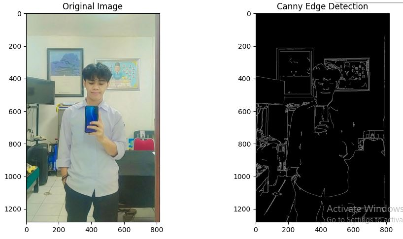
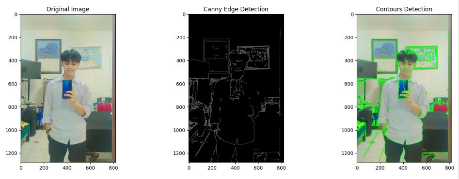

# Ulangan Akhir Semester Pengolahan Citra Digital
#### Nama : Anugrah Sabri
#### NIM  : 202231509
#### 1. Pengolahan Citra Digital
Pengolahan citra digital adalah proses penggunaan algoritma komputer untuk melakukan operasi pada gambar digital. Salah satu tujuan utama pengolahan citra adalah untuk memperbaiki kualitas gambar atau mengekstraksi informasi penting dari gambar tersebut.

#### 2. Deteksi Tepi
Deteksi tepi adalah teknik fundamental dalam pengolahan citra yang digunakan untuk mengidentifikasi titik-titik dalam gambar di mana kecerahan gambar berubah tajam atau memiliki diskontinuitas. Teknik ini sangat penting untuk memahami struktur dan fitur dalam gambar, seperti batas objek, bentuk, dan tekstur. Algoritma Canny Edge Detection adalah salah satu metode yang paling populer dan efektif untuk deteksi tepi.

#### 3.Algoritma Canny Edge Detection
Algoritma Canny Edge Detection dikembangkan oleh John F. Canny pada tahun 1986. Algoritma ini dirancang untuk memenuhi tiga kriteria utama:

* Deteksi tepi yang baik: Algoritma harus mendeteksi tepi sejati sebanyak mungkin.
* Lokasi yang tepat: Deteksi tepi yang ditemukan harus sedekat mungkin dengan tepi sebenarnya.
* Respons minimal: Algoritma tidak boleh mendeteksi tepi palsu sebanyak mungkin.

#### 4.Deteksi Kontur
Deteksi kontur adalah teknik untuk mengekstraksi batas atau bentuk objek dalam gambar. Kontur adalah kurva yang menghubungkan semua titik kontinu sepanjang batas objek dengan warna atau intensitas yang sama. Dalam konteks pengolahan citra, kontur sering digunakan dalam segmentasi gambar dan pengenalan objek.

#### 5.Penerapan dalam Kehidupan Nyata
Deteksi tepi dan kontur memiliki berbagai aplikasi dalam kehidupan nyata, seperti:

* Pengenalan Wajah: Untuk mendeteksi fitur wajah seperti mata, hidung, dan mulut.
* Sistem Keamanan: Untuk mendeteksi intrusi atau objek mencurigakan.
* Industri Medis: Untuk analisis citra medis seperti MRI dan CT scan.
* Robotika: Untuk navigasi dan pengenalan lingkungan.

# Tahapan Cara Menyelesaikan Proyek
Siapkan gambar yang akan diolah


* Import Library
``` python
import cv2 
import numpy as np
import matplotlib.pyplot as plt 
``` 

`import cv2`: Ini mengimpor modul OpenCV, yang diperlukan untuk memproses citra.

`import numpy as np`: Ini mengimpor NumPy, pustaka yang digunakan untuk komputasi numerik, yang sering digunakan dalam pengolahan citra.

`import matplotlib.pyplot as plt`: Ini mengimpor modul pyplot dari pustaka Matplotlib, yang akan digunakan untuk menampilkan gambar dan plot.

* Load the image

```python
image_path = "citra.jpg" 
image = cv2.imread(image_path)
```
Ini adalah langkah pertama di mana gambar dengan nama file "citra.jpg" dimuat menggunakan cv2.imread

* Konversi ke RGB untuk ditampilkan dengan matplotlib

```python
image_rgb = cv2.cvtColor(image, cv2.COLOR_BGR2RGB) 
```


* Deteksi tepi menggunakan algoritma Canny dengan threshold 100 dan 200
```python
edges = cv2.Canny(image, 100, 200)
```


* Deteksi kontur dari hasil deteksi tepi
```python
contours, _ = cv2.findContours(edges, cv2.RETR_EXTERNAL, cv2.CHAIN_APPROX_SIMPLE)
```

*  Salin gambar asli untuk menggambar kontur
```python
image_with_contours = image.copy()
```

*  Gambar kontur pada gambar salinan dengan warna hijau (0, 255, 0) dan ketebalan garis 2
```python
cv2.drawContours(image_with_contours, contours, -1, (0, 255, 0), 2)
```


* Konversi gambar dengan kontur dari BGR ke RGB untuk ditampilkan dengan Matplotlib
 ``` python
 image_with_contours_rgb = cv2.cvtColor(image_with_contours, cv2.COLOR_BGR2RGB)
```


* Output 1: 

```python
plt.figure(figsize=(10, 5))

plt.subplot(1, 2, 1)
plt.imshow(image_rgb)
plt.title('Original Image')
plt.xlabel('Width')
plt.ylabel('Height')
plt.axis('on')

plt.subplot(1, 2, 2)
plt.imshow(edges, cmap='gray')
plt.title('Canny Edge Detection')
plt.xlabel('Width')
plt.ylabel('Height')
plt.axis('on')

plt.tight_layout()
plt.show()
```
Menampilkan gambar asli dan hasil Canny Edge Detection dalam satu figur dengan dua subplot menggunakan Matplotlib.

* Output 2 : 

```python
plt.figure(figsize=(15, 5))

plt.subplot(1, 3, 1)
plt.imshow(image_rgb)
plt.title('Original Image')
plt.xlabel('Width')
plt.ylabel('Height')
plt.axis('on')

plt.subplot(1, 3, 2)
plt.imshow(edges, cmap='gray')
plt.title('Canny Edge Detection')
plt.xlabel('Width')
plt.ylabel('Height')
plt.axis('on')

plt.subplot(1, 3, 3)
plt.imshow(image_with_contours_rgb)
plt.title('Contours Detection')
plt.xlabel('Width')
plt.ylabel('Height')
plt.axis('on')

plt.tight_layout()
plt.show()

```
kode diatas untukMenampilkan gambar asli, hasil Canny Edge Detection, dan hasil Contours Detection dalam satu figur dengan tiga subplot menggunakan Matplotlib.

#### Output 1 :

#### Output 2 : 



